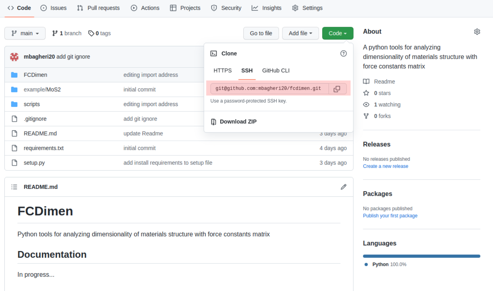

## Basics of Git
****************
 

## Outlines
- Learn how to install git and cnfigure it.
- Learn how to configure github for remote features.
- Learn basic commands for working with git.
- Learn how to work reporitory, branches and forks.


## What is Git and why we need that

- Git is a version control that helps us to record a snapshot of developing process 
- Track changes in contents of project
- Efficient and easier collaboration in code developments

## Git installation and first configurations

To install git on your system use the following commands based on your unix distributions:

If you’re on Fedora (or any closely-related RPM-based distribution, such as RHEL or CentOS), you can use dnf:

```console
$ sudo dnf install git-all
```

If you’re on a Debian-based distribution, such as Ubuntu, try apt:

```console
$ sudo apt install git-all
```

## Configure Git
With the following you can have minimal configurations in git contains name email and your favorite editor that here we selected nano. You can select everything you want.
```console
$ git config --global user.name "Your Name"
$ git config --global user.email yourname@example.com
$ git config --global core.editor nano
```

Verify the configurations with:

```console
$ git config --list
```
## Configure Git-hub

For using github feature, making our local git project online and sync our local project with online version we have to use SSH protocol that allows us connect to remote servers to push and pull code. 
Go to [Connecting to GitHub with SSH](https://docs.github.com/en/authentication/connecting-to-github-with-ssh) and follow the instructions to add ssh key of your system to your github account.

### Verify the git connection 
Try following command in terminal:

```console
$ ssh -T git@github.com
```

If you set up ssh keys correctly, you will see:

```shell
Hi username! You've successfully authenticated, but GitHub does not provide shell access.
```


## Make a git project and basic commands

with following you can make a example project and make **.git** folder that contains all informations about project.

```console
$ mkdir example
$ cd example
$ git init
```

## Adding files
Git takes snapshots only if we request it. We will record changes always in two steps:
- add and commit (with message)
For add files to project we will use `git add` to stage the file in git then we have to commit it with a good message.Here we will make a text file and ask git to record the changes for it:

```console
$ git add sometext.txt
$ git commit -m "This is a example file"
```
In every stage we can use `git status` to see the changes.
Now add some texts to text file save it and use add and commit to see changes in status.

add below text to sometext.txt

One file is called `instructions.txt` and contains:

```shell
* I love Physics.
```
Use `git diff` to see the changes then with follwing we can add updates:

```console
$ git add sometext.txt
$ git commit -m "Updating text file"
```
Try `git status` to see status of project. 

## Git history and log

Git will keep a compelete history of project and we can browse the development and access each state that we have committed that will be used to compare versions and going back in time. we can see a log of project with:

```console
$ git log
```
- `git log --oneline` only shows the first 7 characters of the commit hash and is good to get an overview.
- If the first characters of the hash are unique it is not necessary to type the entire hash.
- `git log --stat` is nice to show which files have been modified.


## Branches

In priciple, branceh is a new place contain a copy of original code that you can work on a new feature, develope and test it and in the final step merge it to main branch of code.
e.g. if you use follwing command you will have a copy of code in a folder that you can edit the codes without broke working code:

```console
$ git branch addfeature master    # creates branch "addfeature" from master
$ git checkout addfeature         # switch to branch "addfeature"
$ git branch                      # list all local branches , using branches shows with *
```

When you finished your editing or add new feature you can merge it to master(main) branch:

```console
$ git merge addfeature
```

You can delete your branch after merging:

```console
$ git branch -d addfeature
```


## Working with existing project

For download a project to your computer and and contribute changes use `git clone repository link`:

```console
$ git clone git@github.com:mbagheri20/fcdimen.git
$ cd fcdimen
```
you can always find the project link in SSH 

## Push and Pull

when you want to upload your git commits or changes from your local system to github use `git push`.
And always remeber before starting working on project download new changes that may made by your collaborators from github with `git pull`

## Summary of git commands

```console
$ git init    # initialize a new repository
$ git add     # add files or stage file(s)
$ git commit  # commit staged file(s)
$ git clone  # clone an existing repository from github
$ git push  # upload changes to github
$ git pull  # download changes from github
$ git branch  # making a new branch
$ git checkout  # change the working branch
$ git merge # merge branch to the main branch
$ git branch -d # delete branch
$ git status  # see what is going on
$ git log     # see history
$ git diff    # show unstaged/uncommitted modifications
$ git show    # shows the change for a specific commit
$ git mv      # move tracked files
$ git rm      # remove tracked files
```
